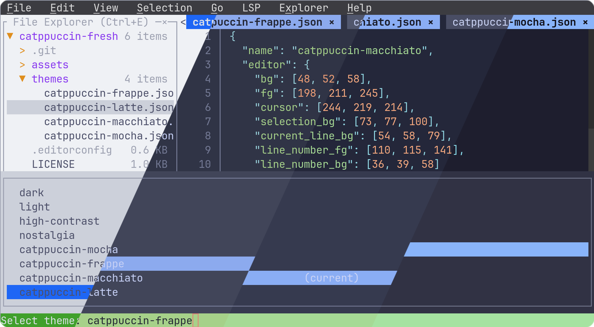
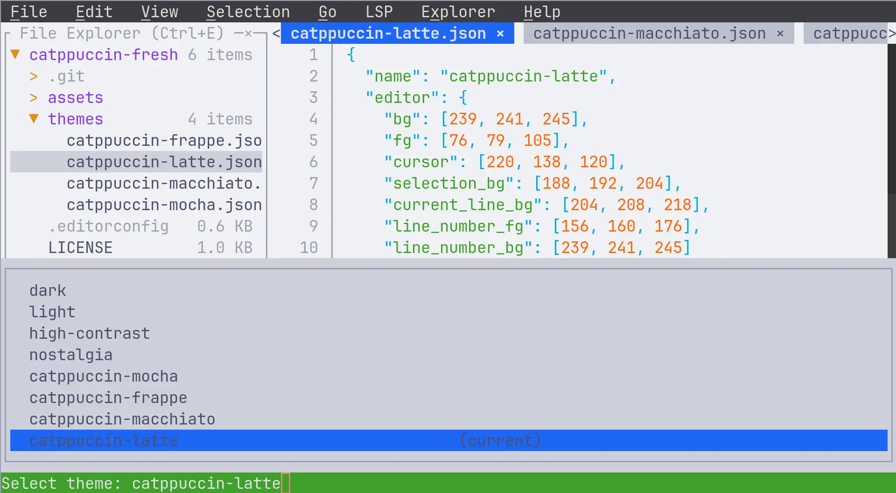
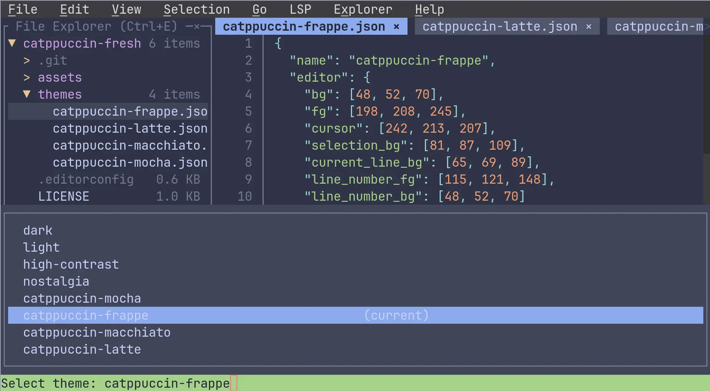
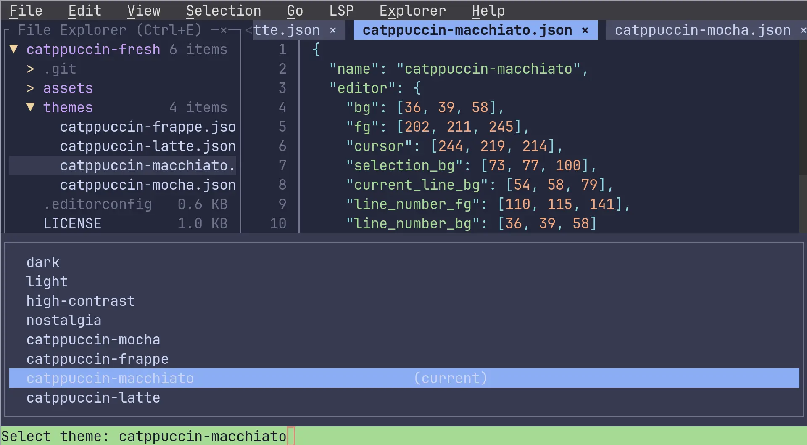
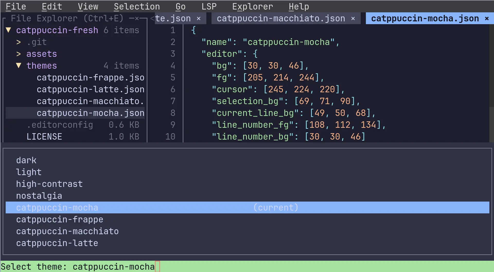

<h3 align="center">
	<br/>
	
	Catppuccin for <a href="https://github.com/sinelaw/fresh">Fresh</a>
	
</h3>

<p align="center">
	<a href="https://github.com/catppuccin/fresh/stargazers"></a>
	<a href="https://github.com/catppuccin/fresh/issues"></a>
	<a href="https://github.com/catppuccin/fresh/contributors"></a>
</p>

<p align="center">
	
</p>

## Previews

<details>
<summary>🌻 Latte</summary>

</details>
<details>
<summary>🪴 Frappé</summary>

</details>
<details>
<summary>🌺 Macchiato</summary>

</details>
<details>
<summary>🌿 Mocha</summary>

</details>

## Usage

1. Find your Fresh themes directory by running:
   ```
   fresh --show-paths | grep themes
   ```
2. Copy your preferred flavor(s) from the `themes/` directory to your Fresh themes directory (typically `~/.config/fresh/themes/`):
   - `catppuccin-latte.json`
   - `catppuccin-frappe.json`
   - `catppuccin-macchiato.json`
   - `catppuccin-mocha.json`
3. Select a theme using one of these methods:
   - **Via UI:** Go to **View** > **Select Theme...** and choose a Catppuccin flavor
   - **Via config file:** Edit `~/.config/fresh/config.json` and set the theme:
     ```json
     {
       "version": 1,
       "theme": "catppuccin-mocha"
     }
     ```

## 💝 Thanks to

- [xunzhou](https://github.com/xunzhou)

&nbsp;

<p align="center">
	
</p>

<p align="center">
	Copyright &copy; 2021-present <a href="https://github.com/catppuccin" target="_blank">Catppuccin Org</a>
</p>

<p align="center">
	<a href="https://github.com/catppuccin/catppuccin/blob/main/LICENSE"></a>
</p>
